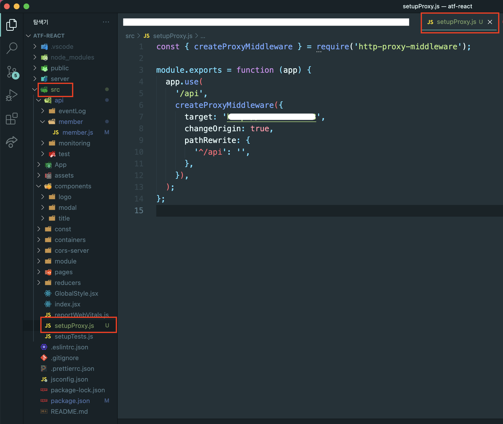
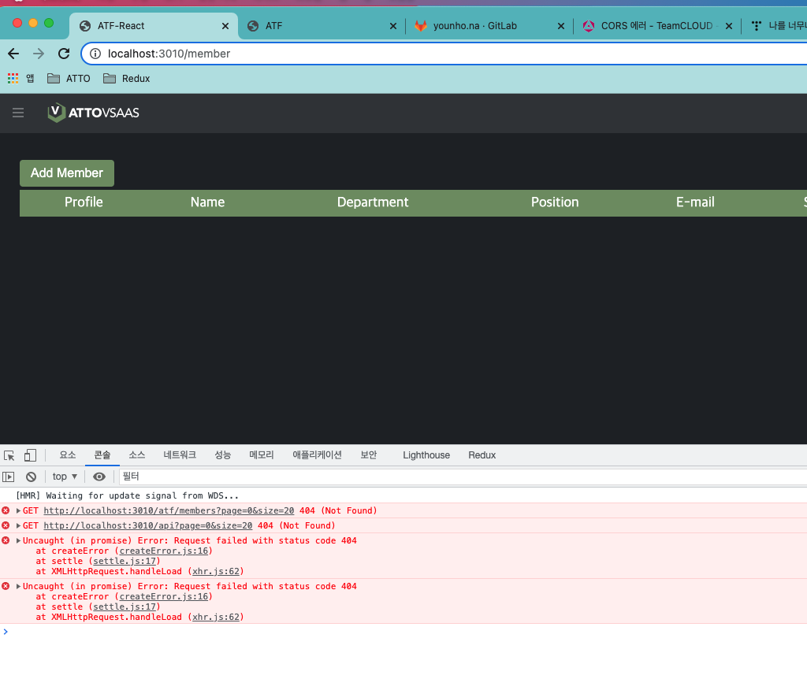

# CORS에러 해결 방법 (React CRA를 사용하여 개발할 때 axios로 요청)

## 사건의 발단

- 현재 회사에서 진행하는 프로젝트는 팀원들의 데이터를 저장하여 사용할 수 있는 server가 있다.
  그래서 나는 GET,POST요청을 보내면서 member list의 CRUD를 진행하려고 하는데
  말로만 듣던 CORS에러가 발생... CORS에러가 뭔지... 왜 발생하는지... 이론적으로는
  들어본 적이 있지만 직접 마주한 적이 처음이라 굉장히 당황했다
  </br>
  </img></br>

- 그때부터 Googling 시작...하루가 지나고...이틀이 지나고... 어떻게 하라는 건지 모르겠다
- 문제는 현재 서버를 담당하는 담당자가 없어서 물어볼 사람을 찾아봤지만... 제대로 아는 사람이 우리팀에는 없었다.
  그래서 다른 사업부의 프론트엔드 개발자에게 도움을 요청하였지만 회사 사정상(현재 회사는 Angular -> React로 프레임워크를 변경 중)
  다른 팀 개발자 역시 이 문제를 해결해주지 못했다.
- 방법은 하나 구글링에서 나온 방법들을 전부 시도해보자

## 문제 해결 과정

1.  첫번째 시도

    - Member서버에서 Access-Control-Allow-Origin=' \* ' 이 설정이 되어 있는지 확인 또는, 없으면 설정 추가하기
      - 같은 팀의 AI 분석 개발자님에게 어렵게 부탁하여 구글에서 얘기하는 설정을 확인 해봤지만 설정을 하는 위치나 추가해야 되는 파일이 뭔지 알 수가 없었다.
      - 첫번째 시도 실패

2.  두번째 시도

    - 요청하는 헤더부분에 Access-Control-Allow-Origin=' \* ', content-type': 'application/x-www-form-urlencoded;charset=UTF-8',
      authorization: 'Basic token' 이러한 설정을 넣어주고 요청을 보냈습니다. -> 두번째 방법은 지금 생각해보면 왜 했는지 모르겠는 시도 입니다.
      이때는 그냥 이것저것 다 해보자는 생각으로...
    - 두번째 시도 역시 실패

3.  세번째 시도
    - 프록시 서버 설정을 커스터마이징한 후 우회하여 서버에 요청하기
      1.  먼저 proxy moddleware를 다운
          `npm install http-proxy-middleware `
      2.  src / setupProxy.js 파일 생성 후 프록시 서버의 커스터마이징 코드 작성
          </br>
          </img></br>
          - target: 요청할 서버
          - changeOrigin: 오리진을 바꿀 것인지
          - pathRewrite: path 설정
      3.  pakege.json 파일 내에 proxy 서버를 사용한다는 것을 알리기 위해 설정 추가
          </br>
          </img></br>
          - "proxy": 이 부분에 요청할 서버를 작성하면 된다.
          - 처음에 나는 2번 과정은 하지 않고 pakege.json파일에만 설정을 추가했더니 실패를 했었다.
      4.  axios.get('url') 요청을 할 때 기존 url부분이 (http://localhost:5000/member) 였다면 (/member) 이런식으로 수정해서 요청
          - ex)
          ```
          async memberGet() {
          const res = await axios.get('http://localhost:5000/members?page=0&size=20');
          return res.data;
          ```
          ```
          async memberGet() {
          const res = await axios.get('/members?page=0&size=20');
          return res.data;
          ```
          - 이 과정까지 진행하면 완료인데 나는 이상하게 화면에 list가 렌더링되지 않는 것이었다.
            처음에는 그냥 또 에러가 났구나...하고 다시 다른 방법을 찾아보고 있었는데
            에러메세지를 자세히 보니 어!! CORS에러가 아니고 404에러잖아!!! 뭐지...
          - 또 다시 새로운 벽...인줄 알았다.
            </br>
            </img></br>
      5.  다행히 build를 껐다 다시 켜보니 CORS에러도 안나고 list도 정상적으로 렌더링 되었다!! 휴....
          이 상태코드 200을 보기 위해 며칠을...하...솔직히 말해서 일주일 넘게 삽질을 했다 지나고 보면 별거 아니지만
          아무것도 모르는 상태에서 해결하려고 하니 정말 오래 잡고 있었다...
          </br>
          </img></br>

## 느낀점

1. CORS에러는 브라우저에서 제한하는 정책으로 서버간의 요청은 CORS에러가 발생하지 않는다
   그래서 proxy 서버가 가능한 것
2. 구글에는 너무나 다양한 종류의 해결 방법이 있고 바로 나오지 않을 수는 있지만 언젠간 답을 준다.
3. 에러메세지를 자세히 보는 습관을 갖자 (위의 4번까지 완료를 하고도 몇시간을 왜 안되는지 찾아봤는데 에러메세지만 진작에 봤어도 404에러에 관해서 찾아 봤을 텐데...)
4. 프론트엔드 개발을 공부하면서 처음으로 이렇게 오래 붙잡고 해결을 해보았다.
   그 전에는 1시간정도 해보다가 안되면 알만한 사람에게 물어보고 대부분 해결 방법을 알려주었었다.
   그래서 스스로 끈기있게 해결하는 습관이 안되어 있었던 것 같다. 지난 일주일이 너무나 괴로웠다.
   그런데 해결을 하고 보니 그 괴로운 감정을 한 번에 날려버리는 희열이 있었다ㅎㅎ
   이 맛에 개발자하나 잠깐 생각했다
   앞으로도 많은 벽이 있고 문제가 있을거지만 이런식으로 해결하다 보면 경험치가 쌓이지 않을까... 라고 생각해본다
   "끝"
