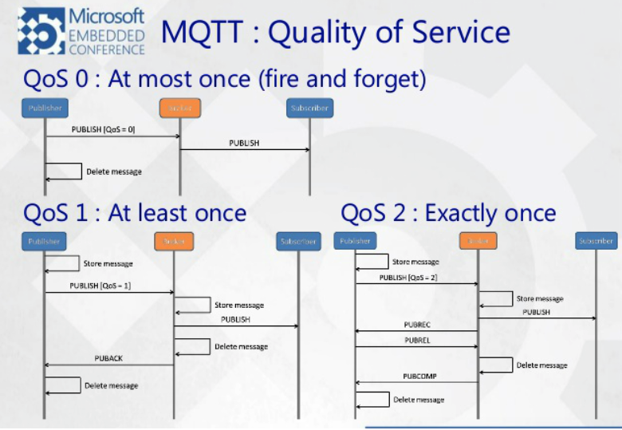

# MQTT란

## MQTT(Message Queuing Telemetry Transport)

- M2M, IOT를 위한 프로토콜로서, 최소한의 전력과 패킷량으로 통신하는 프로토콜
- 기존의 웹에서 통신하던 HTTP등의 프로토콜보다 제한적이고 특수한 상황에서 사용할 수 있는 모바일 특화 프로토콜
- 따라서, IOT와 모바일 어플리케이션 등의 통신에 매우 적합한 프로토콜

## 기본 구조

</img> 
</img> 

- Publisher

  - Topic 발행 ( 1 Topic - N Subscriber 가능 )

- Broker

  - 중계역할, Topic 과 구독, 발행을 총괄 (MQTT의 핵심적인 특징)
  - 브로커의 종류는 많이 있지만 대중적으로 Mosquitto를 가장 많이 사용하는 것으로 조사된다
    </img> 

- Subscriber

  - 특정 토픽의 페이로드 수신을 MQTT에 알려주는 행위

- Topic
  - Publisher에서 발행하는 데이터, Subscriber가 받고자 하는 데이터
    </img> 
  - '/' 를 이용해서 계층적으로 구성할 수 있다 -> 대량의 센서 기기들을 효율적으로 관리 가능
  - 와일드 카드를 포함할 수 있다 ( '+' 와 '#' )
    - ex) 센서 / + / 온도 / + : 같은 부모 노드를 가진 형제 노드 전부를 동시에 구독할 수 있음
    - ex) 센서 / # : 나머지 모든 구간을 와일드 카드로 사용할 때 사용
    - ex) 센서 / + / 온도 / # : +와 # 함께 사용이 가능

## QoS( Quality of Service )

</img> 

- 서비스의 질을 보장해주는 레벨을 말한다.
- 서비스의 종류에 따라서 적당한 QoS 레벨을 선택해야 한다.
  - Level 0 (At most Once)
    메시지는 한번만 전달되며 전달의 성공여부는 확인 하지 않는 레벨
  - Level 1 (At least Once)
    메시지는 최소 한번이상 전달되며 Publishr에게 PUBACK을 전달하여 성공 여부를 알린다.
    하지만 Publishr가 PUBACK을 성공적으로 받지 못하면 Subscriber에게 중복메시지를 보내는 경우가 생긴다.
  - Level 2 (Exactly Once)
    메시지는 반드시 한번만 전달된다. PUBACK방식을 PUBREC으로 핸드셰이킹 함으로써 Broker가 PUBACK을 받지 못하더라도
    Broker에게 메시지를 보냈다는 사실을 알고 있기 때문에 중복메시지를 보내지 않는다.
