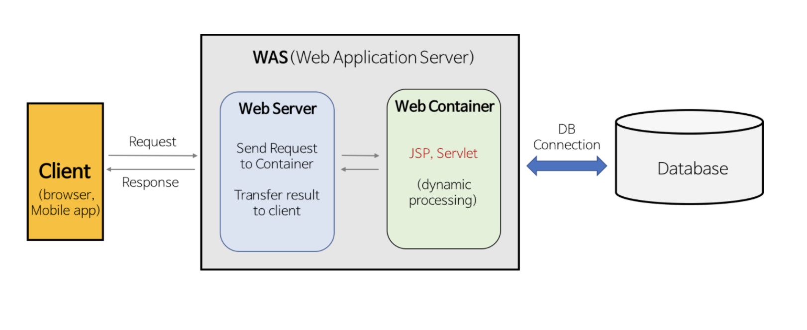

# Apache & Nginx & Nodejs

## 1. 웹서버를 따로 두는 이유
   1. 웹서버의 정의
    - 웹서버는 크게 2가지로 나눌 수 있다.
      - 정적 페이지(Static Page)
        1. 웹서버에 미리 저장된 파일(HTML, IMAGE 파일, CSS, JS)이 그대로 전달되는 웹 페이지
        2. 서버는 사용자의 Request에 해당하는 저장된 웹 페이지를 보냄
        3. 사용자는 서버에 저장된 데이터가 변하지 않는 이상 고정된 웹 페이지를 보게된다
        4. 예) 홈페이지에 회사소개, 포트폴리오 등 내용이 변하지 않고 고정된 페이지
        5. 장,단점
           - 장점: 빠르고(요청에 대한 파일만 전송) 비용이 적게 든다(웹서버만 구축)
           - 단점: 서비스가 한정적(저장된 정보만 보여줄 수 있다)이고 관리가 힘듬(추가/수정/삭제의 작업 모두 수동적)

        - 동적 페이지(Dynamic Page)
          1. 웹서버에 있는 데이터들을 스크립트에 의해 가공처리한 후 생성되어 전달되는 웹 페이지
          2. 서버는 사용자의 Request을 해석하여 데이터를 가공한 후 생성된 웹 페이지를 보냄
          3. 사용자는 상황, 시간, 요청 등에 따라 달라지는 웹 페이지를 보게 됨
          4. 예) 대부분의 웹 페이지는 동적 페이지(블로그, 게시판, 티스토리)
          5. 장,단점
             - 장점: 서비스가 다양하고(다양한 정보를 조합하여 동적으로 생성 후 제공) 관리가 쉽다(웹 사이트 구조에 따라 추가/수정/삭제 등의 작업에 용이)
             - 단점: 상대적으로 느리고(사용자에게 전달하기 전 작업이 필요) 추가 비용이 발생(Web Application Server가 필요)

        </img>
## 2. 대표적인 웹서버 종류 및 특징
## 3. 결론 