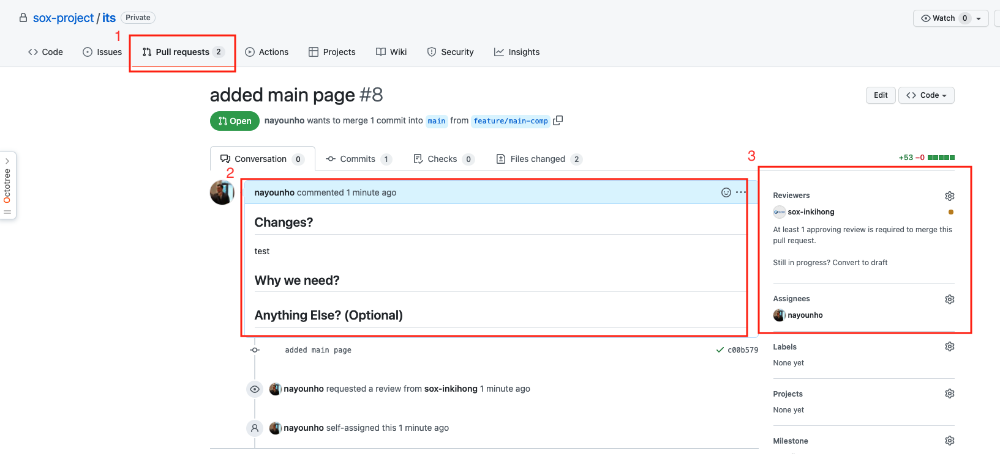

# git 협업 방법

## 1. 진행 순서

fork -> git clone -> git remote add pmorigin -> 작업 진행 -> (작업 후) commit / origin push ->
git pull pmorigin -> (만약 conflictrk 발생) conflict resolve -> commit / push ->
pull request -> (main 레포지토리에서) request 확인 후 결합

## 2. 진행 순서 상세

1. fork

   - main github에서 해당 레포지토리로 이동 후 fork를 눌러 내 github으로 복제하는 과정이다

</img>

2. `git clone 해당 레포지토리 주소(내 github)`

   - fork를 떠오면 내 github에 해당 레포지토리가 생성된다
   - 생성된 레포지토리를 내 local로 clone하는 과정이다

3. git remote add pmorigin

   - 나중에 pull을 받기 위해서 내 local과 pmorigin을 연결하는 과정이다

`git remote add pmorigin 해당 레포지토리 주소(main 레포지토리 주소)`

4. 작업진행

   - local에서 작업 진행

5. (작업 후) commit / origin push

   - 작업 완료 후 fork로 복제해 온 내 github에 commit / push를 진행하는 과정이다

6. `git pull pmorigin main(master)`

   - main 레포지토리에 변경사항이 있을 수 있으니 pull를 받아서 확인하는 과정이다

7. (만약 conflictrk 발생) conflict resolve

   - conflict가 발생하면 출동 부분을 해결하는 과정이다

8. commit / push

   - conflict를 해결하고 commit / push를 다시 한 번 해주어 버전관리를 하는 과정이다

9. pull request

   - pull request를 진행하여 main 레포지토리에 내가 작업한 내용을 합쳐달라고 요청하는 과정이다

</img>

10. (main 레포지토리에서) request 확인 후 결합

    - main 레포지토리를 관리하는 사람이 request를 확인하고 main code와 결합하는 과정이다

## 3. branch 생성

1. origin에서 set up을 한 후, 내 github 주소를 초대해 주면 해당 origin 주소를 clone한다. `git clone origin주소`

2. git branch 생성 후 해당 branch로 이동 `git checkout -b "branch로 분기할 이름"(ex: feature/dialog-comp) //`

3. `git branch` 명령어로 branch 확인

</img>

4. coding 후 git add, commit을 한다

5. git push `git push origin "분기한 이름으로 push"(ex: feature/dialog-comp)`

6. Pull Request

</img>

      1. pull Request tap으로 이동
      2. code 작성 이유 및 바뀐 부분 등을 작성
      3. reviewer를 등록 및 등록한 사람 등록 -> reviewer는 최소 2명을 등록하고 1명 이상 동의를 해야 통과

7. merge insfaction

</img>

      1. Reviewer 동의 후 통과
      2. conversation 확인 후 통과 (Reviewer가 comment를 남기거나 수정할 부분을 알려주면 확인 후 수정)
      3. 해당 코드 Eslint 검사 후 통과 (향후 CI에서 어떤 부분을 검사하느냐에 따라 검사 내용이 달라진다)
      4. 위의 3개가 통과 되면 전체 완료 후 merge
