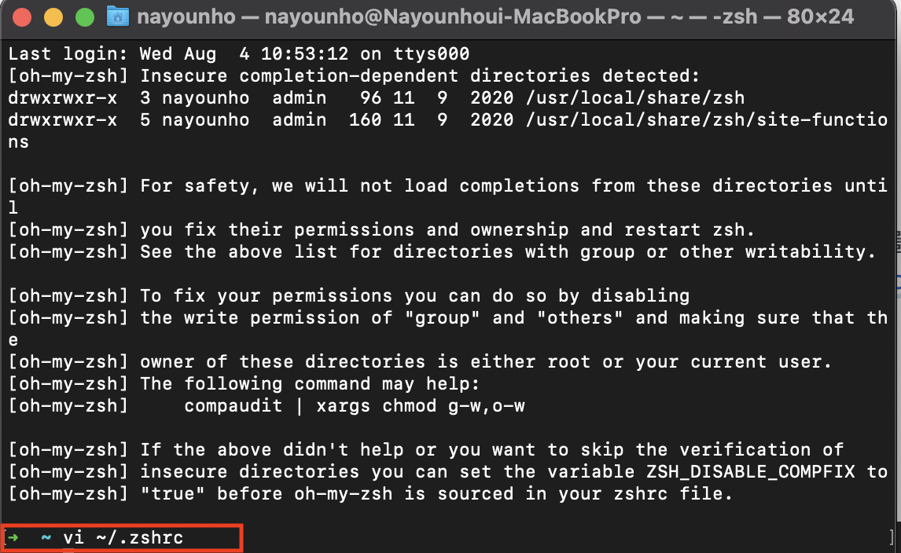
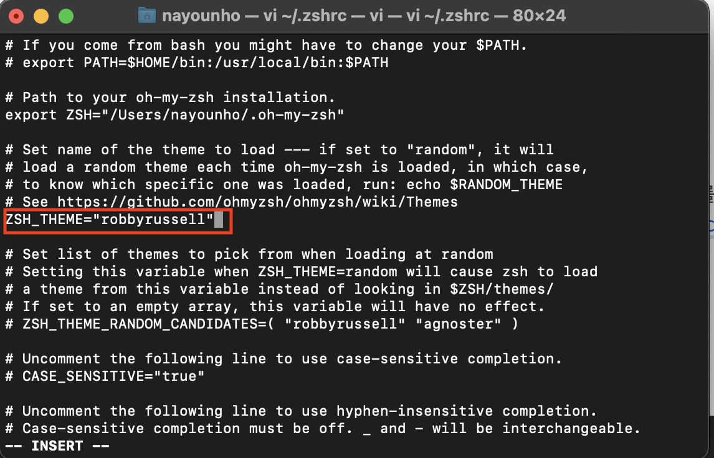
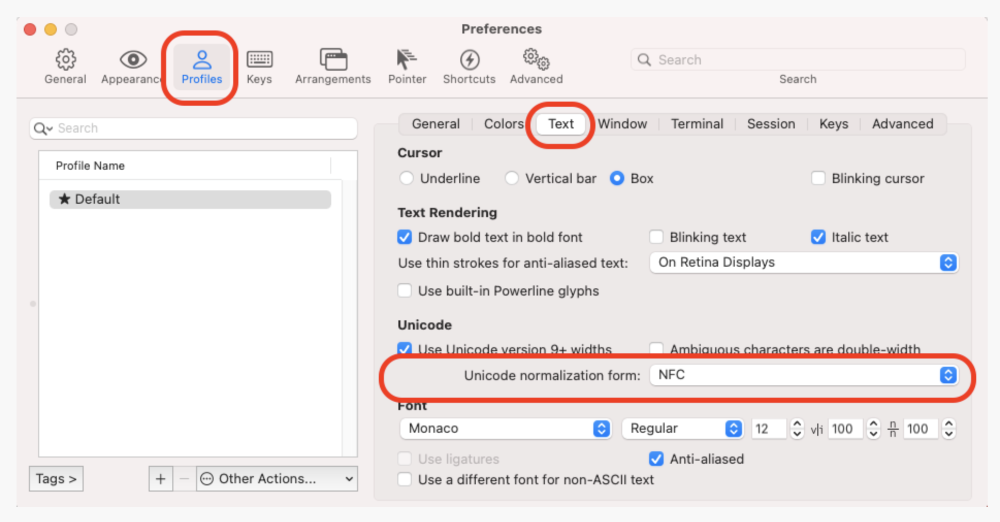

# macOS Iterm2 설정

## Iterm2 + zsh 설정

- 맥북을 새로 구매하여 처음 설정 할 경우 기존 terminal보다 Iterm + zsh 을 사용하게 될 것이다. 

## Iterm2 설치
```
/usr/bin/ruby -e "$(curl -fsSL https://raw.githubusercontent.com/Homebrew/install/master/install)"
```
- zsh 설치
```
brew install zsh
```
- oh my ZSH 설치
```
sh -c "$(curl -fsSL https://raw.github.com/robbyrussell/oh-my-zsh/master/tools/install.sh)"
```

- 설치과정 설명
1. iTerm2 — 맥의 터미널 보조 프로그램
2. Homebrew(brew) —맥에서 라이브러리나 플러그인등을 쉽게 설치하게 도와주는 패키징 매니저
3. ZSH — 쉘의 확장판
4. Oh My ZSH — ZSH를 더 쉽게 사용해주는 플러그인

- 테마 설정
</img>
- 그림과 같이 명령어 입력 후 설정으로 간다
</img>
- 테마를 변경해준다(테마는 oh my zsh를 구글링하면 여러가지 테마를 확인할 수 있다)

## 한글 파일명 깨짐 현상
- 이렇게 설정을 하고 ls 입력 후 파일명을 확인하게 되면 한글 파일의 자음모음이 분리되는 현상이 발생할 수 있다.
- 이럴 경우 해결 방법

</img>
- iterm에서 commend + , 누르면 preference에 들어갈 수 있다.
- 그리고 사진과 같이 이동 후 Unicode normalization form: 에서 none으로 되어 있는 것을 다른 것으로 바꿔준다.
- 해결!