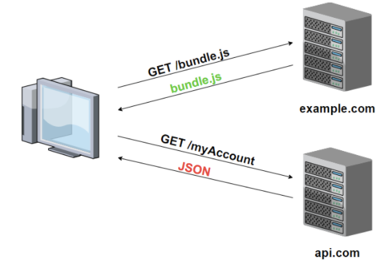

# CORS(교차 출처 리소스 공유)

- SOP(same origin policy) 정책
  - 클라이언트단과 서버단의 origin이 다를 경우 해당 도큐먼트에 접근을 제한하는 정책(보안상의 이슈 차단)
    - origin: 프로토콜, 도메인, 포트
  - 이렇게 다른 origin인 경우에 리소스를 공유하는 방법이 CORS
  
- CORS 에러 해결 방법:
  - 서버단에서 HTTP 응답헤더 Access-Control-Allow-Origin : 부분에 허용하는 도메인 또는 전체허용(*)을 넣어주면 된다
  - 프록시 서버를 통한 우회 접근

- 예를 들어 client에서 GET으로 요청을 보냈을 경우 html, js 는 A라는 컴퓨터에서 가져오고 data는 B라는 컴퓨터에서 가져온다고 했을 경우 CORS 관련 에러가 발생
- 이러한 경우 client에서는 할 수 있는 것이 없고 B컴퓨터에서 CORS 허용을 해주어야 한다

</img>

- 에러 발생 예시
```Access to fetch at ‘https://api.lubycon.com/me’ from origin 
	‘http://localhost:3000’ has been blocked by CORS policy: No 
	‘Access-Control-Allow-Origin’ header is present on the requested resource. 
	 If an opaque response serves your needs, set the request’s mode to ‘no-cors’ 
	 to fetch the resource with CORS disabled.```