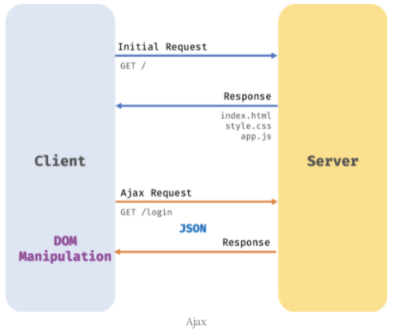

# 렌더링 과정
1. client에서는 GET방식으로 서버에 요청을 보냅니다.
2. 그러면 서버에서는 Redponse로 html파일을 보내줍니다. 
3. client에서는 받은 html를 화면에 렌더링 시키게 됩니다.

</img>

## Ajax: 
   - Ajax로 넘어오면서 전체 html를 다시 받아와 리렌더링 하지 않고 필요한 부분만 리렌더링하는 방식을 채택하였다

1. 변경할 부분을 갱신하는데 필요한 데이터만 서버로부터 전송받기 때문에 불필요한 데이터 통신이 발생하진 않는다
2. 변경할 필요가 없는 부분은 다시 렌더링하지 않는다. 따라서 화면이 순간적으로 깜박이는 현상이 발생하지 않는다
3. client와 서버와의 통신이 비동기 방식으로 이루어지기 때문에 서버에서 요청을 보낸 이후 블로킹 현상이 발생하지 않는다