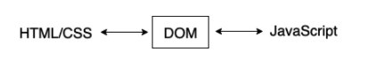
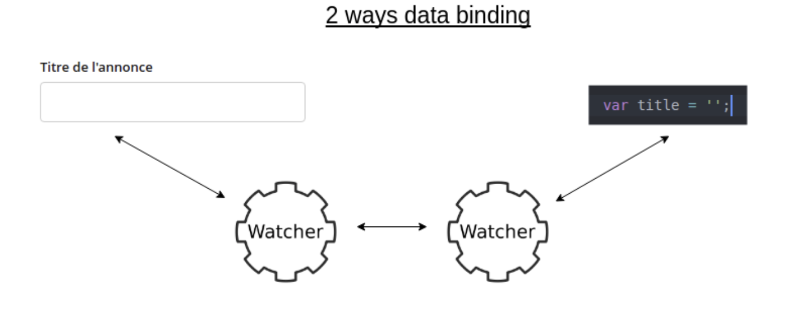
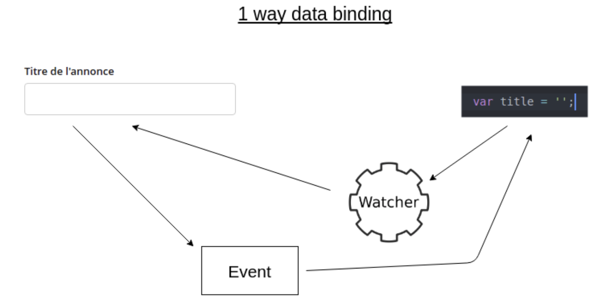

# React Framework

## React 란

- React는 UI 자바스크립트 라이브러리로써 싱글 페이지 애플리케이션의 UI(User Interface)를 생성하는데 집중한 라이브러리이다.
- React는 싱글 페이지 애플리케이션에서 UI를 만드는 자바스크립트 라이브러리이다보니, 싱글 페이지 애플리케이션 제작을 하는 다른 프레임워크에 비해 부족한 부분이 있다.
- 예를 들어 React는 페이지 전환 기능을 제공하지 않기 때문에, React를 사용하여 페이지 전환을 해야한다면, react-route와 같은 추가적인 라이브러리를 사용해야 한다.
- React는 자바스크립트에 HTML을 포함하는 JSX(JavaScript XML)이라는 간단한 문법과 단방향 데이터 바인딩(One-way Data Binding)을 사용하고 있다.
- 가상 돔(Virtual DOM)이라는 개념을 사용하여 웹 애플리케이션의 퍼포먼스를 최적화한 라이브러리이다.

## React의 특징

- Virtual DOM

  - DOM 이란

    - DOM(Document Object Model)이란 문서 객체 모델을 의미
    - 문서객체: html, head, body와 같은 태그들을 js가 이용할 수 있는 (메모리에 보관할 수 있는) 객체
    - DOM은 HTML과 JS를 서로 이어주는 역할

    
    - 웹 페이지를 이루는 태그들을 js가 이용할 수 있게끔 브라우저가 트리구조로 만든 객체 모델

    

- DOM을 직접 접근할 때의 문제점

  - DOM에 직접 접근하려면 DOM Tree의 최상단에 있는 document DOM을 통해서 트리 밑으로 내려가면서 해당 DOM을 찾는 방식으로만 접근할 수 있고,
  - 이러한 최상단 DOM의 접근은 브라우저의 잦은 렌더링을 유발하며, DOM의 작은 변경점조차 이러한 렌더링 과정을 반복하기 때문에 효율성이 떨어지게 된다.

- 가상돔이 필요한 이유

  - 예를 들어 위의 트리구조를 우리가 작업하고 있는 페이지라고 가정하여
  - 태그의 색상을 빨간색으로 변경한다고 했을 때 document.getElementById('li의 id')라는 DOM 접근 메서드를 이용할 것이다.

- 이 방법의 2가지 문제점
  1. 메모리 누수와 속도
  - 개발자가 태그를 변수에 저장하지 않고 매번 와 관련된 접근 메서드를 사용한다면 수많은 document 객체들을 전부 확인하며 찾는 메모리 누수 현상이 발생
  - 또한, 의 변화가 일어난다면 리플로우와 리페인트가 매번 반복되는 현상이 발생하여 시간이 소요
  2. 길어지는 코드의 양
  - 객체를 찾기 위해 작성되는 코드의 양이 길어질 수 있다.
  - 유니크한 id의 네이밍을 위해 고민해야 한다.
  - 해당 태그를 접근하는 메서드의 코드는 짧지 않다. (document.getElementById('li의 id'))

## 가상돔(Virtual DOM) 이란?

- 실제 돔에 접근하여 조작하는 대신 이것을 추상화시킨 JS 객체를 이용해 사용
- 실제돔의 복사본같은 개념
  

- 리엑트의 가상돔을 반영하는 순서 1.데이터가 업데이트 되면 전체 UI를 가상돔에 리렌더링 시킨다. 2.변화 전의 가상돔과 변화 후의 가상돔을 비교 3.변경된 부분만 실제 돔에 적용하여 리플로우를 한 번만 실행

- 가상 돔의 의미와 장점

  - 가상 돔은 말 그대로 별도 객체로 DOM을 생성하는 것이다. DOM에서 발생하는 여러 변경점들을 별도의 공간(버퍼)에 가상 DOM을 생성해 일정 동안 모은 뒤,
    렌더링의 변경 시점이 생기면 그 때 가상 DOM으로부터 변경된 점을 일괄적으로 갱신하는 방법이다. (어차피 DOM을 실제로 수정하려면 최상단 Tree에 접근해야 한다.)
    브라우저의 렌더링 횟수를 줄여 성능 개선을 도모할 수 있다.

- 결론: 자잘한 리플로우 변경이 여러번 실행되는 것 보다는 큰 규모의 리플로우가 한 번 일어나는 것이 더욱 효율적이며, 이것은 성능상의 차이로 나타난다.
  리엑트는 이와 같은 방식을 이용하여 성능 향상을 이끌어 내는 프레임워크이다.

## 단방향 데이터 바인딩

- 데이터 바인딩이란?

  - 두 데이터를 일치시키는 기법
  - 화면에 보이는 데이터와 브라우저 메모리에 있는 데이터(여러개의 자바스크립트 객체)를 일치시키는 것
  - 예를 들어, MVC 모델에서 model과 view를 서로 묶어 model과 view의 "자동 동기화" 시키기 라고 이해할 수 있다.

- 양방향 데이터 바인딩

  - 컨트롤러에서 Model이 변경됨 -> View 변경
  - View에서 scope model이 변경됨 -> 컨트롤러에서 Model이 변경
  - 이렇게 컨트롤러와 뷰 양쪽의 데이터 일치가 모두 가능한 것이 양방향 데이터 바인딩이다.
  - 데이터의 변화를 감지해 템플릿과 결합해 화면을 갱신, 화면의 입력에 따라 데이터를 갱신하는 것 (HTML -> JS, JS -> HTML 양쪽 모두 가능)
  - 양방향 데이터 바인딩은 데이터의 변경을 프레임워크에서 감지하고 있다가, 데이터가 변경되는 시점에 DOM 객체에 렌더링을 해주거나 페이지 내에서 모델의 변경을 감지해 JS 실행부에서 변경
  - 입력된 값이나 변경된 값에 따라 내용이 바로 바뀌기 때문에 따로 체크해주지 않아도 된다.
  - 양방향 데이터 바인딩은 웹 애플리케이션의 복잡도가 증가할수록 유용하다. 수많은 코드의 양을 줄여줄 뿐만 아니라 유지보수나 코드를 관리하기 매우 쉽게 해주기 때문이다.

- 양방뱡 데이터 바인딩의 장단점
  - 장점: 코드의 사용면에서 코드량을 크게 줄여준다.
  - 단점: 변화에 따라 DOM 객체 전체를 렌더링해주거나 데이터를 바꿔주므로, 성능이 감소되는 경우가 있음



- 단방향 데이터 바인딩

  - 단방향 데이터 바인딩은 데이터와 템플릿을 결합해 화면을 생성하는 것 (JS -> HTML만 가능)
  - 사용자의 입력에 따라 데이터를 갱신하고 화면을 업데이트 해야 하므로 단방향 데이터 바인딩으로 구성하면, 데이터의 변화를 감지하고 화면을 업데이트 하는 코드를 매번 작성해주어야 한다.
  - 리액트는 자바스크립트 기반으로, 부모 View에서 자식 View로 바뀐 내용을 직접 전달한다.

- 딘방뱡 데이터 바인딩의 장단점
  - 장점:
    - 데이터 변화에 따른 성능 저하 없이 DOM 객체 갱신 가능
    - 데이터 흐름이 단방향(부모->하위 컴포넌트)이라, 코드를 이해하기 쉽고 데이터 추적과 디버깅이 쉬움
  - 단점: 변화를 감지하고 화면을 업데이트 하는 코드를 매번 작성해야 함



## JSX 문법

- React에서는 JSX라는 독특한 문법을 가지고 있다.
- JSX는 자바스크립트와 HTML을 동시에 사용하며, HTML에 자바스크립트의 변수들을 바로 사용할 수 있는 일종의 템플릿 언어

```
const App = () => {
const hello ='Hello world!';
return <div>{hello}</div>;
};
```

## 선언형 프로그래밍

- 프로그래밍에는 명령형 프로그래밍과 선언형 프로그래밍으로 구별할 수 있다.
- 명령형 프로그래밍은 프로그래밍을 할 때 어떻게(How)에 집중하는 것을 말하며 선언형 프로그래밍은 무엇(What)에 집중하여 프로그래밍을 하는 것을 말한다.
- 명령형 프로그래밍
  - 과정을 중심으로 하는 프로그래밍
- 선언형 프로그래밍

  - 어떻게 동작하는지는 크게 중요하지 않고 배역의 값을 2개로 만들기 위해서만 집중하는 프로그래밍

- 명령형 & 선언형

<명령형>

```
const double = (arr) => {
let results = [];
for (let i = 0; i < arr.length; i++){
results.push(arr[i] \* 2);
}
return results;
}
```

<선언형>

```
const double = (arr) => {
return arr.map((elem) => elem \* 2);
}
```

<명령형>

```
<ul id=”list”></ul>
<script>
var arr = [1, 2, 3, 4, 5]
var elem = document.querySelector("#list");

for(var i = 0; i < arr.length; i ++) {
  var child = document.createElement("li");
  child.innerHTML = arr[i];
  elem.appendChild(child);
}
</script>
```

1. 새로운 리스트를 추가할 ul태그 생성
2. 자바스크립트의 querySelector를 이용하여 표시할 위치를 가져온다.
3. for문을 사용하여 하나씩 리스트에 아이템을 추가

<선언형>

```
const arr = [1, 2, 3, 4, 5];
return (

  <ul>
    {arr.map((elem) => (
      <li>{elem}</li>
    ))}
  </ul>
);
```

1. HTML 안에서 map 매서드를 이용하여 리스트 아이템을 추가

## 컴포넌트 기반

- React에서 웹 UI를 개발할 때 컴포넌트라는 최소한의 기능을 하는 작은 단위로 코드를 나누어 개발하게 된다.
- 이렇게 작은 단위의 코드로 개발을 하게 되면 재사용을 할 수 있게 되어 생산성을 향상 시킬 수 있다.
- 또한, 컴포넌트로 나누어 개발을 하면 테스트하기가 쉬워지고 코드를 유지보수하는데 큰 편의성을 제공한다.

- 컴포넌트 UI개발

```
const Title = () => {
return <h1>Hello world</h1>;
};

const Button = () => {
return <button>This is a Button</button>;
};

const App = () => {
return (
<div>
<Title />
<Button />
</div>
);
};
```
