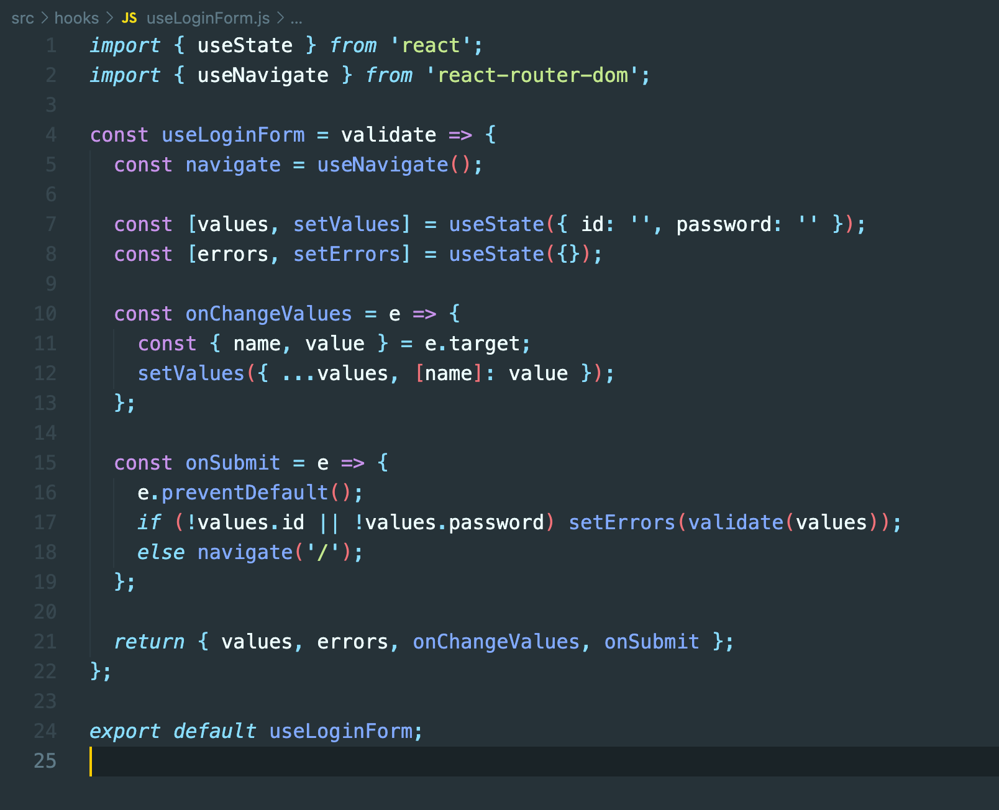

# React, validation CustomHook 만들기

## 1. Input, Label 컴포넌트

- Atomic design을 적용하기 위하여 최소 단위로 쪼개서 component 설계
- Atomic design의 최소 단위인 atoms 컴포넌트

 

 

## 2. ValidationInput 컴포넌트

- atoms와 atoms를 결합하여 molecules 컴포넌트 설계

 

## 3. LoginPage 컴포넌트

- 화면에 molecules 컴포넌트들의 조합을 띄우는 page 작성
- 기존 atomic design에서는 templates의 단위가 있고 molecules의 조합으로 템플릿을 만들어 page별로 설계하는 과정이 있지만
  내가 사용할 때 templates 단위는 필요하지 않을 것 같아 templates단위는 빼고 설계 -> templates 단위까지 진행하게 되면
  props 드릴링이 과도할 것으로 판단

 

## 4. useLoginForm Hooks

- CustomHook 설계
- onChangeValues : id, password input창에 e.target.value를 useState로 관리하는 values에 저장하는 기능
  name 프로퍼티를 사용하여 중복 코드를 제거
- onSubmit : id, password input창이 비어있는지 체크하고 입력되었다면 main page로 이동
  id, password input창이 비어 있다면 validate 모듈을 이용하여 validation 체크를 해준다
  그리고 useState로 관리되는 errors에 프로퍼티가 채워지게 되고 이 errors를
- onSubmit 함수는 form태그에 사용되는데 e.preventDefault()을 최상위에 입력해주어야 한다.

 

## 5. validate 모듈

- LoginPage에서는 input창이 비어있는지만 체크하지만 나중에 회원가입 페이지 설계 시 정규 표현식을 이용하여 정해진 조건을
  검사하는 함수를 추가하면 된다

 
